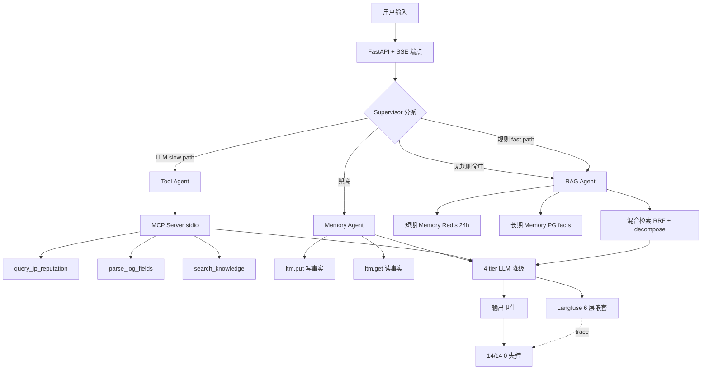
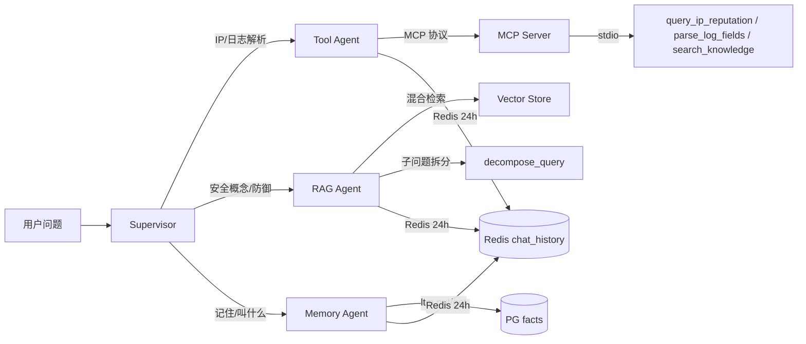
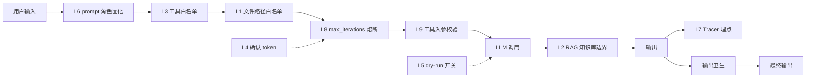

# SecOps Copilot - Backend

> AI 安全运营研判助手 · v2 架构（4 Agent 协同 + 三层 Memory + MCP）

[](https://www.python.org/)
[](https://fastapi.tiangolo.com/)
[](https://langchain-ai.github.io/langgraph/)
[](LICENSE)

---

## ✨ 核心亮点

- 🧠 **4 Agent 协同**：Supervisor（规则快路 + LLM 慢路 + RAG 兜底）调度 RAG、Tool、Memory 三个专业 Agent 分工协作
- 🧬 **三层 Memory**：短期 Redis（24h 对话上下文 + 思考过程回显）+ 长期 PostgreSQL（用户事实画像，upsert 后 SELECT 验真）+ 向量 LanceDB（历史相似对话注入 prompt）
- 🛡️ **纵深安全防护**：9 层防御体系（输入校验 → 工具白名单 → 熔断 → 输出卫生），14/14 注入测试 0 失控
- ⚡ **真流式体验**：自研增量 JSON 信封剥离器，**首 token 延迟降低 64%**（30.7s → 11.16s）
- 🔭 **全链路可观测**：6 层嵌套 Trace（trace → multi-agent → rag/tool/memory → LLM/检索）+ Langfuse 集成，问题定位秒级

---

## 🚀 快速开始

### 前置要求

- Python 3.12+ / [uv](https://github.com/astral-sh/uv) / Redis / PostgreSQL / Docker（可选）

### 安装与启动

```bash
# 1. 克隆
git clone https://github.com/sec-8/secops-copilot.git
cd secops-copilot

# 2. 环境配置
cp .env.example .env
# 填入 OPENAI_API_KEY / LANGFUSE_KEY / REDIS_URI / DATABASE_URL

# 3. 初始化 PostgreSQL（创建表）
psql -U postgres -f scripts/init_db.sql

# 4. 本地启动
uv sync
uv run uvicorn app.main:app --port 8000 --reload

# 或 Docker 一键起
docker compose up
```

### 访问

- API 文档：http://localhost:8000/docs
- **v1 端点**：`POST /chat/stream`（手写 ReAct，轻量研判）
- **v2 端点**：`POST /v2/chat/stream`（4 Agent 协同 + 三层 Memory，主力）
- **历史拉取**：`GET /chat/history?session_id=&user_id=`（Redis 24h 短期记忆）

---

## 🏗️ 架构

### 1. 系统总览（7 大件）



### 2. 4 Agent 协同（核心新能力）



### 3. 9 层安全防护数据流



---

## 🛡️ 安全防护一览

| 层次 | 防护措施 | 说明 |
|------|---------|------|
| L1 | 文件路径白名单 | 限制可读路径范围 |
| L2 | RAG 知识库边界 | 知识库与笔记库隔离 |
| L3 | 工具白名单 | 仅允许预定义工具调用 |
| L4 | 高风险工具确认 Token | 高危操作需二次确认 |
| L5 | Dry-run 全局开关 | 预执行模拟，避免误操作 |
| L6 | System Prompt 角色固化 | 强约束系统身份 |
| L7 | 全链路 Tracer 埋点 | 6 层嵌套 Trace 可审计 |
| L8 | max_iterations 熔断 | 防止死循环耗尽资源 |
| L9 | 工具入参校验 | 正则 + 纯函数校验 |

---

## 🧪 评测 & 验证

### RAGAS 评测（v1 / v2 A/B 对照）

```bash
uv run python eval/run_ragas.py --retriever hybrid   # v1：hybrid 检索基线
uv run python eval/run_ragas.py --retriever lcel     # v2：LCEL 链路
```

**样例评测集**：`eval/rag_dataset_sample.jsonl`（内含 **8 条**典型用例，涵盖单主题/多主题/对比题/半有据陷阱）
- > 💡 完整版 46 条数据集因业务适配性较强，未随仓公开，你可按相同格式替换为自己的测试数据。

**运行产物（本地生成，不纳入版本控制）**

脚本运行后会在 `eval/` 目录下生成明细 CSV（已加入 `.gitignore`）：
- `eval/ragas_hybrid.csv`（v1 明细）
- `eval/ragas_lcel.csv`（v2 明细）

**验证目标**

运行脚本后请自行关注以下 4 项指标，以确认修改是否引入退化：
- **Faithfulness**（忠实度）
- **Answer Relevancy**（答案相关性）
- **Context Precision**（上下文精确率）
- **拒答命中率**（拒绝回答的准确率）

> ⚠️ **注意**：由于 RAGAS 依赖大模型作为评分器（Judge），具体数值会因所用的评分模型（如 GPT-4o-mini vs. Llama-3）及 API 版本不同而产生较大波动。**建议以 A/B 对照的相对趋势为准**，而非绝对分值。

### 🧪 验证

项目提供端到端测试脚本，覆盖 v1/v2 检索链路及 Memory 持久化验证：

```bash
# 启动服务（另开终端）
uv run uvicorn app.main:app --port 8000 --reload

# 一键运行全部验证
uv run python scripts/test_all.py
# 预期：v1 回归通过 · v2 4 Agent 协同通过 · Memory 读写通过
```

**单独运行**：
- `scripts/test_v1.py` — v1 端点回归
- `scripts/test_v2.py` — v2 4 Agent 端到端用例（RAG / Tool / Memory 写 / Memory 读）
- `scripts/test_history.py` — 短期 Memory 24h 拉取验证
- `scripts/probe_v2_trace.py` — 6 层 trace 嵌套探针


---

## 🛠️ 技术栈

| 类别 | 技术 |
|------|------|
| 后端框架 | FastAPI + Uvicorn |
| Agent 编排 | LangGraph + LangChain MCP Adapters |
| RAG 检索 | LanceDB / sentence-transformers / jieba / hybrid RRF + decompose |
| Memory | Redis（24h）+ PostgreSQL（长期事实）+ LanceDB（向量记忆）|
| LLM | OpenAI SDK（兼容 Ark / DeepSeek / Ollama）+ 4 tier 降级链 |
| 可观测 | Langfuse v4 + 自定义 Tracer（JSONL 双写）|
| 部署 | Docker / docker-compose |

---

## 📂 项目结构

```
secops-copilot/
├── app/                # v1 业务代码（端点 / ReAct 循环 / 工具 / 安全）
├── app_v2/             # v2 核心（4 Agent / 真流式 / MCP / Memory 链）
├── rag/                # RAG 检索核心（混合检索 / 向量库 / 拆分）
├── observability/      # 可观测（Tracer / Langfuse 上报）
├── knowledge/          # 安全知识库（Markdown 源文件）
├── eval/               # RAGAS 评测（样例数据集 + 评测脚本）
├── scripts/            # 测试与工具脚本（init_db / 探针 / 端到端）
├── Dockerfile          # Docker 构建
└── docker-compose.yml  # 一键编排
```

---

## 🤝 配套仓库

- **前端**：[secops-copilot-web](https://github.com/sec-8/secops-copilot-web)
- **演示 Demo**：联系维护者获取

---

## 📄 License

MIT © Sec-8

