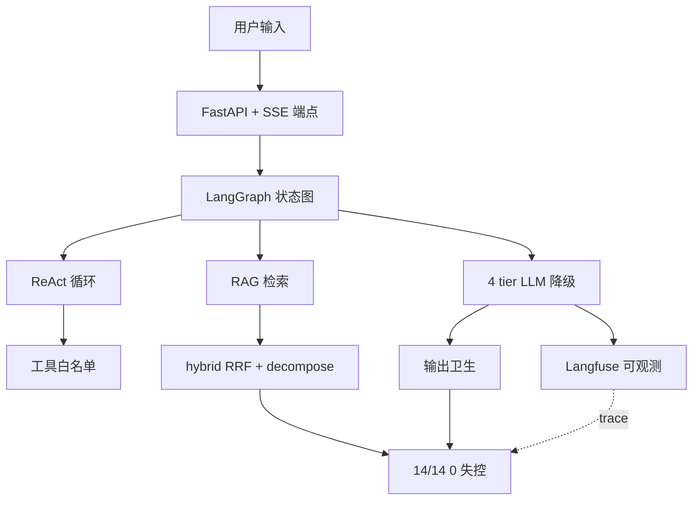
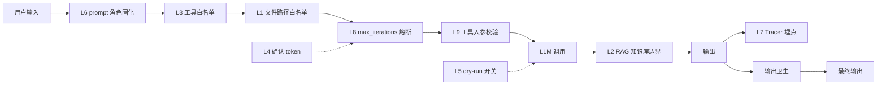

# SecOps Copilot - Backend

> AI 安全运营研判助手 · 后端 · 5 大件全栈

[](https://www.python.org/)
[](https://fastapi.tiangolo.com/)
[](LICENSE)

## 🎯 5 大件

| # | 大件 | 实现 |
|---|------|------|
| 1 | **可观测全链路** | Tracer 抽象（sink 模式）+ Langfuse 接入，6 层嵌套 trace |
| 2 | **可演示实时推理** | SSE 4 事件流式（thinking_start / tool_call / tool_result / final_answer）|
| 3 | **主路径挂了不破** | 4 tier 降级链（Ark → DeepSeek → Ollama → Refuse），JSONL 兜底 |
| 4 | **14/14 注入 0 失控** | 4 类攻击（路径/语义/工具/资源）+ 9 层防护 |
| 5 | **可部署交付** | Docker 4 文件（env 透传 + host.docker.internal + 代码卷挂载 + 多阶段构建）|

## 📊 关键数据

- **RAG 评测**：46 条评测集 / **faithfulness 0.97** / **context_precision 0.80** / 拒答 **14/14=100%**
- **注入样例**：**14/14 0 失控**（A 路径 5 + B 语义 3 + C 工具 3 + D 资源 3，4 类全覆盖）
- **防护层次**：**9 层**（L1 文件白名单 / L2 数据架构 / L3 工具白名单 / L4 确认 token / L5 dry-run / L6 prompt / L7 Trace / L8 max_iterations / L9 入参校验）
- **可观测**：**5 万 events/月**（Langfuse 免费版）/ 7 天保留

## 🏗️ 架构

### 5 大件架构图



### 9 层防护数据流



## 🚀 快速开始

### 前置要求

- Python 3.12+
- [uv](https://github.com/astral-sh/uv)（包管理）
- Docker Desktop（可选）

### 安装

```bash
# 1. 克隆
git clone https://github.com/sec-8/secops-copilot.git
cd secops-copilot

# 2. 复制环境变量模板
cp .env.example .env
# 编辑 .env，填入 OPENAI_API_KEY / LANGFUSE_* 等
```

### 启动

```bash
# 方式 1：本地启动（推荐开发）
uv sync
uv run uvicorn app.main:app --port 8000 --reload

# 方式 2：Docker 一键起
docker compose up
```

### 访问

- API 文档：http://localhost:8000/docs
- SSE 端点：`POST /chat/stream`
- 知识库：`/knowledge/security/*.md  /knowledge/*.md`

## 🛡️ 9 层防护层次

| Layer | 防护 | 实现 |
|-------|------|------|
| L1 | **文件路径白名单** | `is_read_allowed()` |
| L2 | **RAG 知识库边界** | 知识库与笔记库拆分 |
| L3 | **工具白名单** | `TOOL_MAP` |
| L4 | **HIGH_RISK_TOOLS 确认 token** | `add_pending_confirmation()` |
| L5 | **dry-run 全局开关** | `dry_run_wrapper` |
| L6 | **system prompt 角色固化** | `SYSTEM` prompt |
| L7 | **Tracer 全链路埋点** | `Tracer` 类 |
| L8 | **max_iterations 熔断** | ReAct 循环 |
| L9 | **工具入参校验** | 纯函数 + 线性正则 |

## 🧪 评测

```bash
# 跑 RAGAS 评测
uv run python eval/run_ragas.py

# 数据集质检脚本
uv run python validate_dataset.py
```

**评测集**：`eval/ragas_dataset.jsonl`（46 条，含单主题/多主题/对比题/半有据陷阱）

## 🛠️ 技术栈

- **后端**：Python 3.12 / FastAPI / LangGraph
- **RAG**：LanceDB / sentence-transformers / jieba
- **LLM**：OpenAI SDK（兼容 Ark / DeepSeek / Ollama）
- **可观测**：Langfuse / Tracer（自定义）
- **前端**：React + TypeScript + Vite + SSE（**见 frontend-repo**）
- **部署**：Docker / docker-compose

## 📂 项目结构

```
secops-copilot/
├── app/                # FastAPI 业务（agent / graph / tools / security / llm/）
├── rag/                # RAG 检索（hybrid / decompose / ask / vector_store）
├── observability/      # 可观测（tracer / langfuse_sink）
├── knowledge/          # 安全知识库（Markdown 源）
├── eval/               # RAGAS 评测（46 条数据集 + 评测脚本）
├── scripts/            # 工具脚本（test_sse.py 等）
├── Dockerfile          # Docker 化
├── docker-compose.yml  # 一键启动
└── requirements.txt    # Python 依赖
```

## 📝 License

MIT

---

## 🤝 配套仓库

- **前端**：[secops-copilot-web](https://github.com/sec-8/secops-copilot-web)
- **演示 Demo**：（可现场演示）
